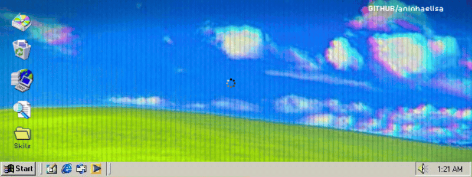

<picture align="center">
  <source media="(prefers-color-scheme: dark)" srcset="https://raw.githubusercontent.com/aninhaelisa/aninhaelisa/output/github-contribution-grid-snake-dark.svg">
  <source media="(prefers-color-scheme: light)" srcset="https://raw.githubusercontent.com/aninhaelisa/aninhaelisa/output/github-contribution-grid-snake-dark.svg">
  
</picture>
